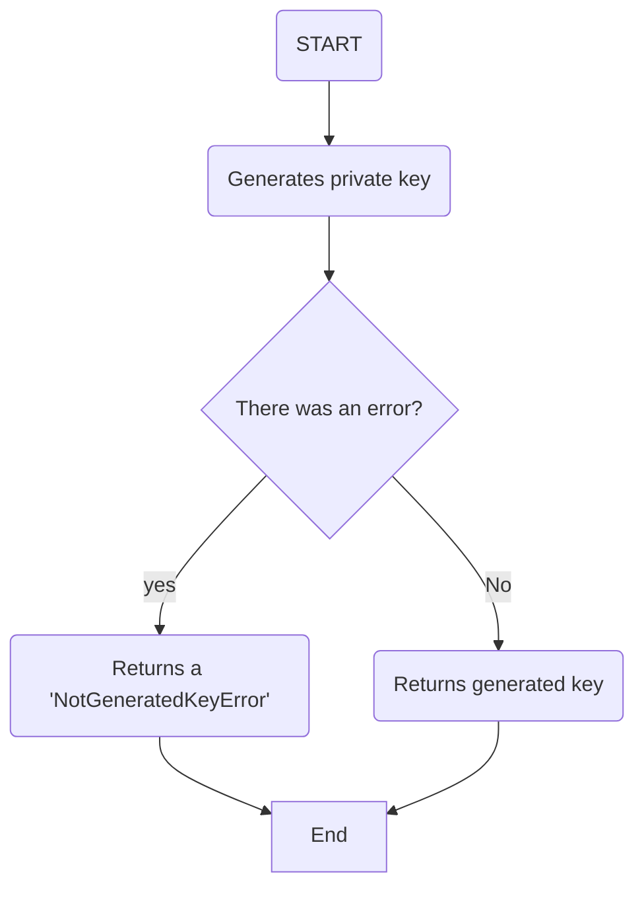

# Anonymous chat v1 HLD (High Level Design)

## Intended audience

The intended audience for this document includes individuelas across the world who are interested in or affected by the -Anonymous Chat- code base.

## Intended propouse

The intended propouse of this document is to create a High-level Design (HLD) to explain the functionality of the first iteration of -Anonymous Chat-

## Solution

### Description

*Anonymouse Chat* is a coudebase designed to facilitate secure, private conversations between users while ensuring anonymity. The system aims to create a safe 
environment for users to comunicate without revealing their identities, using end-to-end encyrption and privacy-preserving techniques. The application will 
include features like real-time messaging, user authentication with anonymity preservation, and a lightweight interface. 

### Propused deliverable

#### Encrypter
The Encrypter module is responsible for ensuring the secure transmission of messages within the application by leveraging the RSA encryption method. This module will generate a unique pair of cryptographic keys: a private key, which remains securely stored within the user’s device, and a public key, which can be shared with other users for message encryption.

When a user sends a message, the module will utilize the recipient's public RSA key to encrypt the content, ensuring that only the intended recipient, who holds the corresponding private key, can decrypt and read the message. The Encrypter module also handles the storage and management of foreign public RSA keys received from other users, enabling seamless and secure communication between parties.

By incorporating robust encryption techniques, this module plays a critical role in maintaining privacy and data security, ensuring that sensitive information is protected against unauthorized access or interception.

##### Generates private key

